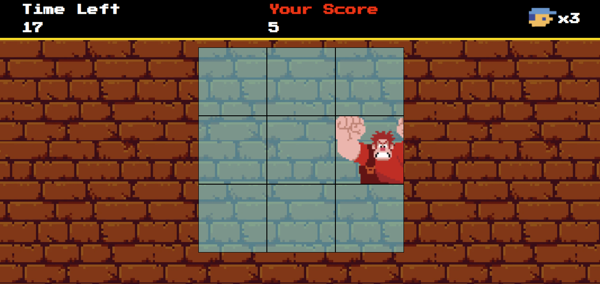

# Wreck-It Ralph Game Project

Bem-vindo ao Wreck-It Ralph Game Project! Este é um jogo simples criado usando `javascript`, `html` e `css`, inspirado no universo do filme "Detona Ralph". O jogo inclui recursos como temporizador, pontuação, vidas e efeitos sonoros para proporcionar uma experiência de jogo envolvente.

## Funcionalidades

- **Temporizador:** O jogo possui um temporizador que conta o tempo restante para completar o desafio. O jogador precisa fazer a maior pontuação possível dentro do tempo limite.

- **Pontuação (Score):** O jogador acumula pontos ao clicar no quadro onde **_Ralph_** aparece.

- **Vidas (Life):** O jogador começa o jogo com um número específico de vidas. Cada vez que o jogador falha em um desafio, ele perde uma vida. O jogo termina quando o jogador fica sem vidas.

- **Efeitos Sonoros:** O jogo inclui efeitos sonoros para fornecer uma experiência mais imersiva. Os efeitos sonoros são reproduzidos em eventos importantes do jogo, como acertar um desafio ou perder uma vida.

## Como Jogar

1. **Objetivo:** Complete o desafio dentro do tempo limite para acumular pontos. Evite perder vidas para continuar jogando.

2. **Controles:** Use o mouse clicando na tela para interagir com os elementos do jogo. Clique nos quadros corretos para ganhar pontos.

3. **Temporizador:** Observe o temporizador na tela para acompanhar o tempo restante. O jogo termina quando o tempo se esgota.

4. **Pontuação:** A pontuação é atualizada à medida que você ganha pontos ao completar os desafios.

## Acesse o jogo pelo link:

[Wreck-It Ralph](https://wreck-it-ralph.vercel.app)